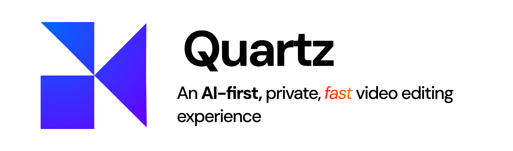
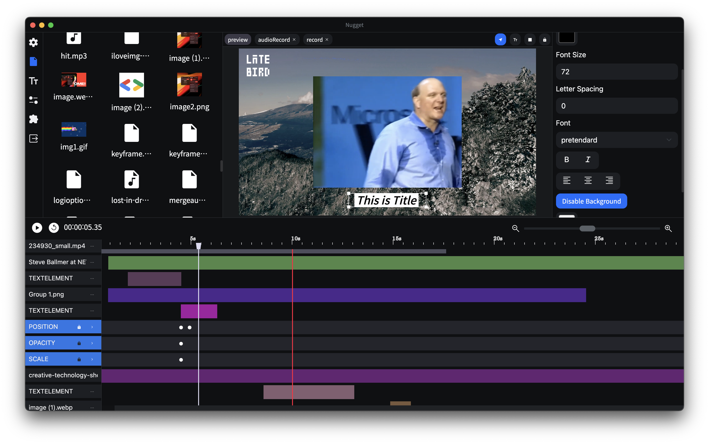

# Quartz

An AI-enabled powerful video editor that lets you edit videos without any expertise. It uses LLMs and ML models compiled and deployed on Edge devices (Snapdragon X platforms) along with a hierarchical completion strategy that maximizes performance and speed. Even with small LLMs (8B parameters), we are able to demonstrate a use-case that can be deployed for much more complex use-cases. We use Whisper and other ML models optimized for NPU performance using ONNXRuntime-QNN.

Best part? You never have to upload any sensitive or private information online. You can do everything locally, for free and with speed.

It is built by Team Quartz for **Snapdragon Edge AI** Hackathon at Bengaluru, 2025.

## System Architecture

## ML Models Used

We are using the following models. They are deployed on either NPU/CPU (based on their pre-trained availability).
- Llama 3.1 8B (AnythingLLM) - For chat completions.
- Whisper Base (NPU for Speech-to-Text, CPU for time-stamped transcriptions) - For speech to text and transcriptions (.srt)
- Large Mask (LaMa) Inpainting (For Video Stabilization)
- ESRGAN (NPU) - For increasing quality of image
- MiDAS (NPU) - Depth Estimation for Background Blurring 
- ViT (CPU) - Image Classification for image metadata  
## Features
All basic functionality of a video editor - but powered by an LLM that saves your number of clicks. Just speak out your command, and your timeline will transform as you dream.

- Chat Interface
- Audio Input to Chat
- Speech to Text
- Text to Speech
- Audio/Video to .srt
- Background Removal
- Background Blurring
- Adding images using their content
- Adding text overlays 
- OpenAI Compatibility for LLM
- Add shapes
- Color Picker Eyedrop
- Hierarchical Completion for small LLMs
- Add a segue/slide
- Denoise the audio/video
- Super Resolution for photos/videos
- Video Stabilization (still in works)
- Support for all standard formats (mp4, mov, mp3, wav...)
- Audio mixing
- Fast rendering with FFmpeg
- Re-position, Scale, Opacity, Rotation animation, Keyframe
- 8k Edit & 4k Edit & more resolution
- Screen Record & Audio Record
- Cross Platform support (only change ML models)

## Demo Video

You can check out a limited demo of the website at the [following link](https://demo.nugget.cartesiancs.com/).

## Installation

Follow [INSTALL.md](INSTALL.md)

## Roadmap

Since this project is a fork of another video editor, we plan to keep adding features. Here are the current plans:
1. Query Decomposition
2. Adding support for faster video tool processing (stabilization, background removal, etc.)
3. Multi-Tool Handling
4. Adding API comptaibility for LLMs
5. UI and Speed Improvements
6. Compilation of binaries for different platforms

## Contributors

 <a href = "https://github.com/thearnavrustagi">
   Arnav Rustagi
 </a>
 
 <a href = "https://github.com/thisabhinav26">
   Abhinav Lodha
 </a>
 
 <a href = "https://github.com/pjrcodes">
   Pranjal Rustagi
 </a>
 
 <a href = "https://github.com/and-human">
   Anshuman Sharma
 </a>
 
 <a href = "https://github.com/jalansubham7">
   Subham Jalan
 </a>

## License

We are adopting the MIT license. [license file](./LICENSE)
